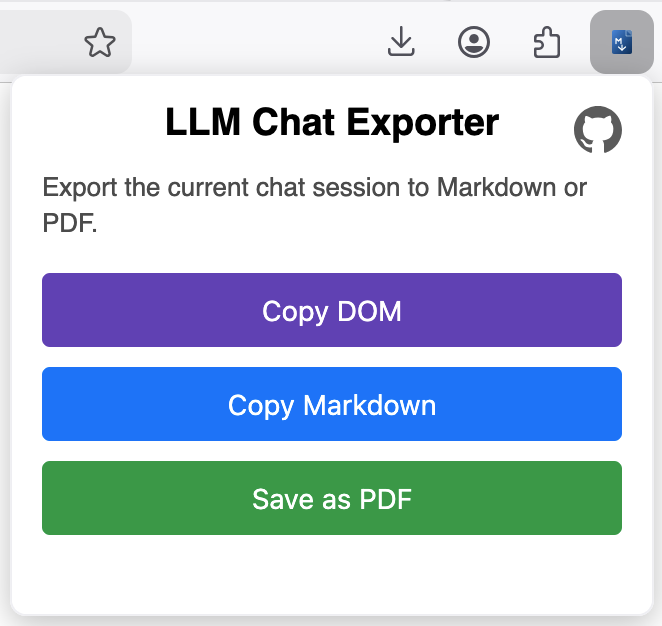

# LLM Markdown Copier Firefox Extension

**LLM Markdown Copier** is a secure and lightweight Firefox extension that lets you export chat sessions from large language model (LLM) web apps as clean, shareable Markdown, portable PDF documents or raw HTML document object model ([DOM](https://en.wikipedia.org/wiki/Document_Object_Model)). It currently supports OpenAI ChatGPT ([`chatgpt.com`](https://chatgpt.com)), Anthropic Claude ([`claude.ai`](https://claude.ai)) and Google Gemini ([`gemini.google.com`](https://gemini.google.com)). **The extension is intentionally simple: everything happens entirely in your browser and nothing is ever sent to any server.**

## Features

  

- **One‑click export to Markdown.** Convert the currently open chat into a structured Markdown document with a [Quarto](https://quarto.org/) YAML header. The exported text is copied directly to your clipboard.

- **High‑quality PDF downloads.** Generate a PDF from your conversation using `pdfmake`, a client-side PDF generation library. **No Canvas Approach!** Leading to high quality pdf generation even for long conversations. The PDF is directly build based on the extracted Markdown content.

- **Full DOM capture.** Need the raw page source for debugging or archival purposes? A third button allows you to copy the complete HTML document to your clipboard.

- **Minimal permissions.** The extension uses the `activeTab` permission to execute scripts in the currently active tab only in response to a user action (clicking the extension button), and the `clipboardWrite` permission to copy exported content to the clipboard. It does not read from your clipboard or access unrelated browsing data. **Host permissions are restricted to the ChatGPT, Claude, and Gemini domains only.**

- **Open source.** Open source license (AGPL-3.0) You can inspect the code or build it yourself from the [GitHub repository](https://github.com/fschwar4/llm_copier).

> **🔒 100% client‑side.**  
> All data extraction and conversion happen in your browser — no requests to external servers, no telemetry, and no tracking.

## Roadmap

- [ ] Restructure directory layout (images)
- [ ] Add support for additional LLM web apps
- [ ] Decision about Emoji and special character support
  - [ ] would increase file size significantly

## Contributing

Contributions are welcome! Feel free to open issues or pull requests to improve model detection for additional providers, enhance the PDF layout or optimise performance on extremely long conversations.

This projects uses the [pdfmake](https://github.com/bpampuch/pdfmake) library for PDF generation.
